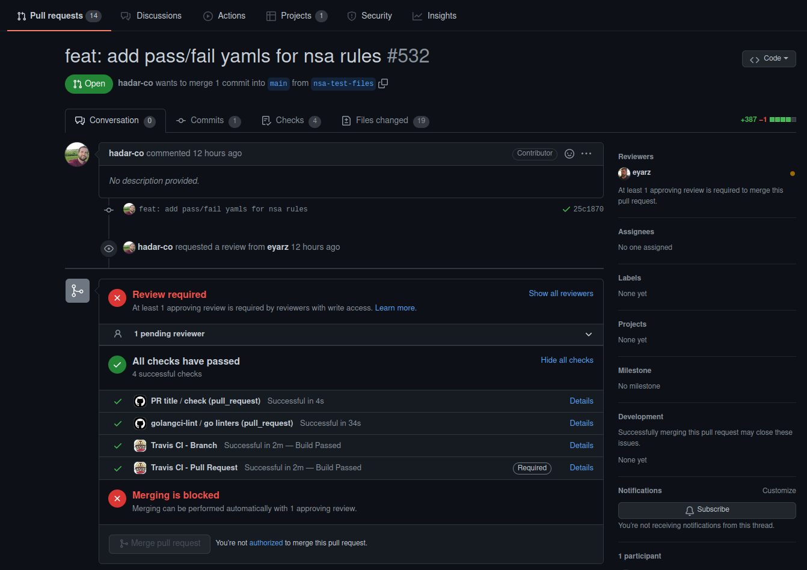
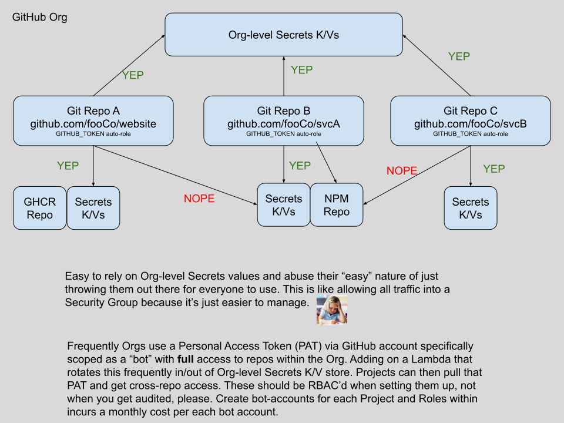
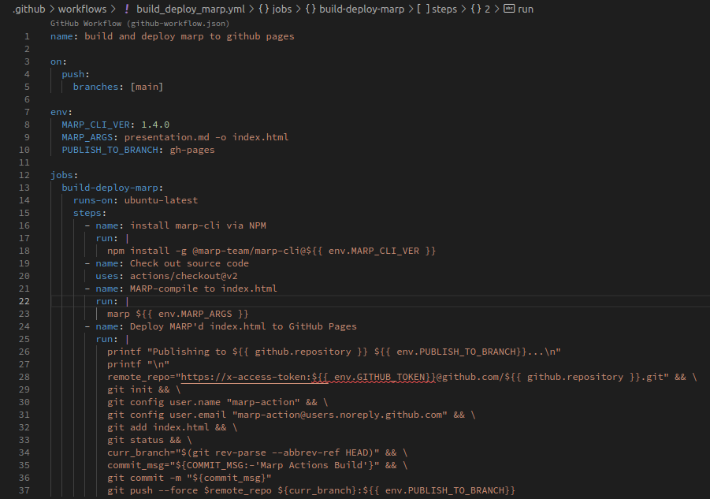

# **GitHub for CI**

---

# **Continuous Integration**

`Software development practice where developers regularly merge their code changes into a central repository, after which automated builds and tests are run.`

Grady Booch first proposed the term `CI` back in 1991! He however, did not advocate integration several times a day.

I wonder why...

---

# **What if?**

We could shorten the feedback loop :infinity:

* Get more feedback, sooner, for your commits.
* Reduce amount of time spent onboarding new team members around quality expectations

Control our static analysis tools (linters) with basic version management (pre-commit.com)

---

# **Start locally**

* provide analysis of your style or usage (traditional linters or static analysis)
  * Java, Python, Go, TS, JS, PHP
  * Terraform, CloudFormation, Ansible, Jenkinsfiles
  * Kubernetes, Helm
  * Markdown, YAML

Configuration is typically dotfiles in project root. Team uses PR / code review
process to come to agreement about what style and checks are relevant.

---

# **Take it to da source**

You've got local tooling providing feedback in your IDE, driven by dotfiles.

Next we need to ensure that those same standards are enforced somewhere central.

Source control seems like a good place, can we build these checks into existing or new workflows?

---

# **pre-commit for consistency**

* Ensure CI runs the same locally as it does in Actions
  * "It worked on my machine" <- :x:
  * Control linting dependencies (golang-ci, eslint)
* pre-commit.com
  * Tracks each check tool and version
  * Installs virtual env (usually) for requires
* Aim for idempotency
  * Re-run custom checks without intervention

---

# **Bringing GitHub in**

Run the same git hooks, tests with Actions

Each test maps to an Actions `Job`

Job outcomes reported in a PR's "Check"

---

# **GitHub and the PR**

* Pull Requests are central to ideaology
* Continuous Integration (CI) is first-class if you want it
* Build consensus, visibility across your team(s)

---

# **wtf is a PR**

"Please pull my fork's changes into your project"

"Please merge my branch's changes into our project"

---

# **Made for Remote**

GitHub built this for global teams collaborating
on small to large open source projects

* Discuss changes
* Inline code comments
* Full-blown code reviews

---

---

# **CI tooling**

* Establishes quality standards for team
* Standards live in source control: `.golangci.yml`
* Increase confidence in releases
* Decrease reliance on :heart: medication
* Start contributing faster on new projects

---

# **CI tooling in GitHub**

* Actions "Jobs" are PR Checks in their UI
* Re-run tests on each PR commit
* No waiting for peers to give an initial review
* Decrease cycle time from PR to merge

---

# **CI to save $**

* Ten developers on a team save one hour every week
* That is >480 hours or $72,000/yr if billing $150/hr
* When preventing outages... priceless

---

# **Plan it out**

* How can we use branches for envs/deploys? :seedling:
* Basic deployments thru yaml Actions
* Utilize Argo, Flux for more complex
* Write your own fancy :tophat: Actions in JS

---

# **Repo design and reuse**

* Look at existing popular open source projects :eyes:
* Utilize Template Repos if you're not monorepo

---

# **Repo Permissions**

* Codeowners
  * Control at directory or file-type level
  * PRs for certain files require certain reviewers
  * Drops into Repos' root directory

* Who owns what?
  * Docs team: `*.md` files
  * DevSecOps: `.github/`
  * Developers: `.`

---

# **Branch Protection Policies**

* N approvals before mergeable
* Require reviews by users/teams scoped in Codeowners file. Ex I changed a .go file I'll need a `Developers` team member to approve the change
* Require certain "Checks" (Actions Jobs) to pass
* Restrict who can push to branches that match selector string ie only `Release` role can push to `release/*` or `prod`

---

# **Internal repos**

* Only available to `Enterprise` plan right now
* "Innersource" in Corpo Lingo
* Store things like Dockerfiles, reusable Actions for CI/CD, linter dotfiles in these repos for re-use by other teams or projects

---

# **Create a mock "ideal" repo**

* Include fully functional CI/CD Actions
* Run these mocks on a schedule rather than event (merge) to act as a canary to detect issues before product teams that rely on em'
* Answer less questions about how to implement, bring feedback into mock repo as singuar source of knowledge as process evolves

---

# **GITHUB_TOKEN**

* Secret token provided by GitHub to an Action
* Do cool things with Actions with near-zero setup
  * Upon merge to `main` we'll generate and upload a new doc to repo's GitHub Pages!
* It doesn't allow you to interact with *other* repos
* Ability to limit scope even more (ex: read only)
* One Time Use (however long Action runs)

---

# **Secrets**

* Internal Key/Value store built into GitHub
* Enterprise/Org can create "Org-level" secrets akin to a Global variable
  * Create overly permissive scenario with ease!
* Bot accounts scoped to a purpose/role
  * Issue each RBAC'd bot a Personal Access Token (PAT) + way to rotate

---

---

# **Secrets Gotchas**

* Consider using Secrets only as way to bootstrap a Vault/SSM params integration
* Secrets have a special `type` within Actions input/outputs
  * Auto-obfuscated to prevent leaks, defeat with a bash one-liner to insert spaces between chars when printing to stdio/log
  * Secrets cannot (currently) be used as an `Output` from a Reusable Action
  * Javascript-based Actions are more flexible here

---

# **Improve Security today**

* Enable beta feature if available to scan for secrets
* Create or utilize existing tools to audit your repos to ensure they are private / internal / public
* Enable MFA if you can
* Create a lifecycle for old repos, or just delete them

---

# **Actions**

Common Examples:

* Build and deploy static content to GitHub Pages
* Build app, pkg into container, store in repo
* Build ephemeral env, run smoke tests, destroy

Drive em by event or schedule

---

Compile static site and deploy to GitHub Pages

---

---

Build app and deploy to GHCR.io
(GitHub Container Repo)

---

---

GKE Autopilot
Deploy App
Run Postman tests
Destroy

---

---
