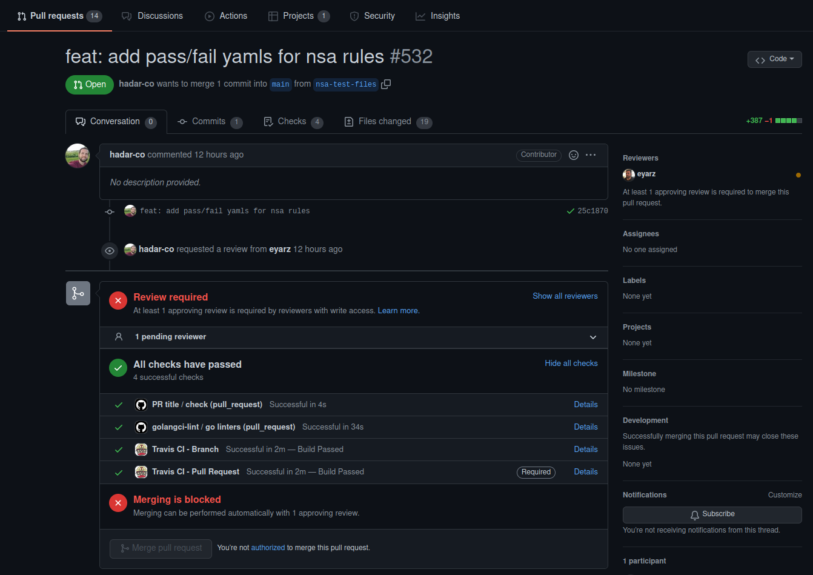

# **GitHub in the Enterprise**
PRs and CI for ROI, oh my

---

# **Purchased by Microsoft for 7.5 Billion dollars in 2018**

This is generally considered a lot of money.

---

# **Can they be trusted?**

* Probably

---

# **What's good?**

* RBAC
  * Release, Developer, DevOps, ...
* Full Audit logs
  * Last six months by default
  * Search by actor, repo, event or action
* Container and NPM repos
  * 3rd party tools scan for security issues
* Innersource repos
  * Reusable Actions

---

# **What's Next?**

* Codespaces
  * Secure, web-based development environment
* Copilot
  * AI helps you write code
* Open roadmaps hosted in GitHub projects

---

# **GitHub and the PR**

* Pull Requests are central to ideaology
* Continuous Integration (CI) is first-class citizen by Actions PR "Checks"
* Code reviews build consensus, visibility, confidence and frustration at times

---

---

# **CI tooling**

* Establishes quality standards for team
* Increases code quality over time
* Standards live in innersource repos as flat files
* Increase confidence in releases, decrease reliance on heart medications
* Less time ramping up for new devs
  * Less questions for leads
  * Start contributing faster

---

# **CI tooling in GitHub**

* Actions reports these as "Checks" for PR
* Feedback comes as fast as you can push to PR
  * Run smoke tests in complex environments
* No waiting for peers to give an initial review
* Decrease cycle time from PR to merged

---

# **I still don't care**

* Save ten developers on a team one hour every week
* That is >480 hours or $72,000/yr if billing $150/hr
* What about preventing outages and the cost of lost sales and longer-term reputation issues?

---

# **Using CI the right way**

* Ensure CI runs the same locally as it does in Actions
  * "It worked on my machine..." <- never uttered
  * Control dependencies and their versions
* pre-commit.com
  * Tracks each check tool and version
  * Installs virtual env (usually) for requires
* Aim for idempotency
  * Run and re-run tests without manual intervention

---

# **Plan it out**

* Simple policies are best, this isn't AWS
* GitOps or a Hybrid?
* Drive basic deployments thru Actions
* Utilize Argo, Flux for more complex
* Custom JS Actions hosted internally

---

# **Repo design and reuse**

* Look at existing popular open source projects :grin:
* Utilize Template Repos once you've got a good POC
    * One for Go, Typescript, wordpress blog, whatever
    * Any GH plan can use templates!

---

# **Repo Permissions**

* Codeowners
  * Control at directory or file-type level
  * Similar to Git ignore file in format
  * PRs for certain files require certain reviewers
  * Drops into Repos' root directory

* Who owns what?
  * Docs team: `*.md` files
  * DevSecOps: `.github/`
  * Developers: `.`

---

# **Branch Protection Policies**

* N approvals before mergeable
* Dismiss approvals if changes come in after
* Require reviews by users/teams scoped in Codeowners file. Ex I changed a .go file I'll need +2 from `Developers` team members.
* Require certain "Checks" (Actions) to pass
* Restruct who can push to branches that match selector string ie only Release can push to `release/*`

